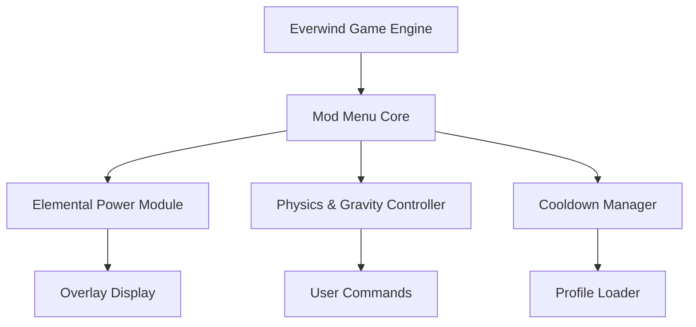

# Everwind Mod Menu 🌪️

The **Everwind Mod Menu** is a complete in-game customization hub that empowers players to reshape the fantasy world of *Everwind* exactly as they want. Designed for performance, creativity, and immersion, it delivers instant access to movement, magic, and environment variables through a seamless on-screen overlay.

Whether you’re crafting cinematic replays, optimizing your combat flow, or testing elemental loadouts, this mod menu offers a flexible environment for experimentation without altering save files or breaking stability.

---

## 🧭 Overview

The **Everwind Mod Menu** connects directly to the game’s runtime values, providing live editing of stamina, mana, speed, and world dynamics — all reversible and safe. The user interface is inspired by studio debugging tools but designed for accessibility, letting anyone enhance gameplay instantly.

[!IMPORTANT]

> All edits are temporary. The menu does not touch game files, saves, or cloud data — every change resets upon closing.

---

## ⚙️ Feature Highlights

* **🌬️ Elemental Power Control:** Boost or balance Fire, Wind, and Arcane damage output.
* **💨 Movement & Speed Editor:** Modify sprint, climb, or glide velocity in real time.
* **🔥 Cooldown Adjuster:** Set ability recharge anywhere from instant to delayed.
* **🌙 World Flow Control:** Alter global time, gravity, or light fade for creative captures.
* **💫 Resource Toggles:** Enable infinite stamina or mana for uninterrupted exploration.
* **🎮 Overlay Integration:** Clean visual interface with keyboard or controller navigation.

Example Config:

```ini
[MOD_MENU]
InfiniteMana=True
StaminaRegen=Fast
MagicAmplifier=1.8
SpeedMultiplier=1.5
CooldownReduction=0.4
TimeScale=1.0
GravityScale=0.9
```

[!NOTE]

> Configurations are stored under `/Everwind/config/mod_presets/` and can be swapped mid-game.

---

## ⚙️ Setup & Activation

1. **Download** the verified Everwind Mod Menu package.
2. **Extract** it to your *Everwind* game directory.
3. **Run** `Everwind_ModMenu.exe` as Administrator.
4. **Launch the game**, then press `F1` to display the overlay.
5. **Use arrow keys or controller input** to navigate and modify values.

Command Example:

```bash
Everwind_ModMenu.exe /preset="Windwalker.cfg"
```

[!WARNING]

> Disable other performance overlays before launch to avoid graphical overlap or capture conflicts.

---

## 💻 Compatibility

| Platform           | Status | Notes                   |
| ------------------ | ------ | ----------------------- |
| Windows 10/11      | ✅      | Fully supported         |
| Steam Version      | ✅      | Auto-attach enabled     |
| Epic Games Version | ⚙️     | Manual attach required  |
| Controller Support | ✅      | Native UI navigation    |
| Offline Mode       | ✅      | 100% functional offline |

Accessibility: toggleable dark/light themes, scalable UI elements, and colorblind mode for improved readability.

---

## 🧩 System Flow Diagram



---

## 🧠 Custom Presets

**Windwalker (High Agility)**

```ini
[PRESET_WINDWALKER]
InfiniteMana=False
StaminaRegen=Fast
MagicAmplifier=1.2
SpeedMultiplier=1.8
CooldownReduction=0.6
GravityScale=1.0
```

**Stormcaller (Magic Mastery)**

```ini
[PRESET_STORMCALLER]
InfiniteMana=True
MagicAmplifier=2.5
CooldownReduction=0.0
SpeedMultiplier=1.1
TimeScale=1.0
```

**Celestial Mode (Cinematic Capture)**

```ini
[PRESET_CELESTIAL]
InfiniteMana=True
MagicAmplifier=1.0
SpeedMultiplier=0.7
TimeScale=0.5
GravityScale=0.8
```

Switch between presets instantly with hotkeys `F2`, `F3`, and `F4`.

---

## 💬 FAQ

**Q: Can I use the Mod Menu with visual reshades or ENBs?**
A: Yes, it runs independently and won’t conflict with shader-based mods.

**Q: Does this affect saved progress or achievements?**
A: No — it’s a live overlay; all effects are reset after exiting.

**Q: How do I record gameplay with active overlays?**
A: Use OBS or NVIDIA ShadowPlay — the menu supports transparent capture.

**Q: Is it performance-heavy?**
A: Very lightweight, averaging under 2% CPU usage and <40 MB RAM.

**Q: Can I create my own presets?**
A: Yes, just duplicate any `.cfg` in the config folder and adjust parameters.

---

## 🚀 Feature Roadmap

| Version | Feature                                  | Status     |
| ------- | ---------------------------------------- | ---------- |
| v1.5    | Dynamic Weather & Wind Intensity Control | ✅ Released |
| v1.6    | Companion AI Behavior Tuner              | 🚧 Testing |
| v1.7    | Spell VFX Color Customization            | 🧩 Planned |

---

## 🏁 Final Thoughts

The **Everwind Mod Menu** is more than a tweak tool — it’s your creative key to the world’s elemental systems. From cinematic control of time and gravity to enhanced magic output, it turns *Everwind* into a living sandbox of experimentation and expression.

Rewrite the wind. Shape the flow. Command your world.

---
